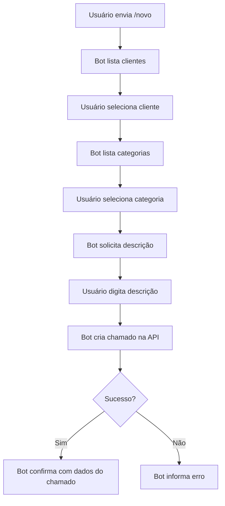

# Guia do Bot Telegram

## Como Criar o Bot

### 1. Abrir o BotFather

1. Abra o aplicativo Telegram
2. Na barra de busca, procure por: `@BotFather`
3. Clique no bot oficial (tem verificação azul)
4. Clique em "Start" ou envie `/start`

### 2. Criar um Novo Bot

1. Envie o comando: `/newbot`
2. O BotFather pedirá um nome para o bot
   - Digite: `Portal Chamados Impulso` (ou outro nome)
3. O BotFather pedirá um username
   - Deve terminar com "bot"
   - Exemplo: `impulso_chamados_bot`
   - Deve ser único

### 3. Obter o Token

Após criar o bot, o BotFather enviará uma mensagem com:
- Link para acessar o bot
- **Token de API** (guarde com segurança!)

Exemplo de token:
```
123456789:ABCdefGHIjklMNOpqrsTUVwxyz
```

### 4. Configurar o Token no Projeto

Copie o token e cole no arquivo `.env`:

```bash
cd packages/telegram-bot
cp .env.example .env
nano .env
```

Cole o token:
```env
TELEGRAM_BOT_TOKEN=seu-token-aqui
API_URL=http://localhost:3001
```

## Comandos do Bot

### /start
Inicia a interação com o bot e mostra as opções disponíveis.

**Resposta:**
```
Olá [Nome]! 👋

Bem-vindo ao Portal de Chamados da Impulso Tecnologia.

Comandos disponíveis:
/novo - Abrir um novo chamado
/ajuda - Ver ajuda
/cancelar - Cancelar operação atual
```

### /novo
Inicia o fluxo de abertura de um novo chamado.

**Fluxo:**

1. **Selecionar Cliente**
   - Bot mostra lista de clientes cadastrados
   - Usuário seleciona um cliente

2. **Selecionar Categoria**
   - Bot mostra lista de categorias
   - Usuário seleciona uma categoria

3. **Digitar Descrição**
   - Usuário digita a descrição do problema
   - Bot cria o chamado

4. **Confirmação**
   - Bot confirma a criação com ID do chamado

**Exemplo de uso:**
```
Você: /novo

Bot: 👤 Selecione o cliente:
[Botões com clientes]

Você: [Clica em "Empresa ABC"]

Bot: 📂 Selecione a categoria do chamado:
[Botões com categorias]

Você: [Clica em "Suporte Técnico"]

Bot: 📝 Digite a descrição do problema:
(Seja o mais detalhado possível)

Você: O sistema não está abrindo após a última atualização

Bot: ✅ Chamado criado com sucesso!

🎫 ID: 123e4567-e89b-12d3-a456-426614174000
📋 Status: OPEN
⚡ Prioridade: MEDIUM

Você receberá atualizações sobre este chamado em breve.
```

### /ajuda
Mostra instruções de uso do bot.

### /cancelar
Cancela a operação atual e limpa a sessão do usuário.

## Fluxo de Criação de Chamado



## Personalizações Possíveis

### Adicionar Comando de Consulta

Você pode adicionar um comando `/meus` para listar chamados do usuário:

```typescript
bot.onText(/\/meus/, async (msg) => {
  const chatId = msg.chat.id;
  const userId = msg.from?.id;

  // Buscar chamados deste userId
  const tickets = await getTicketsByTelegramUser(userId);

  // Formatar e enviar
});
```

### Notificações de Atualização

Implementar notificações quando um chamado for atualizado:

```typescript
// No backend, após atualizar ticket
if (ticket.telegramChatId) {
  await sendTelegramMessage(
    ticket.telegramChatId,
    `🔔 Chamado #${ticket.id} atualizado!\n` +
    `Status: ${ticket.status}\n` +
    `Atendente: ${ticket.assignedTo?.name}`
  );
}
```

### Adicionar Prioridade

Permitir usuário escolher prioridade:

```typescript
// Adicionar mais um passo no fluxo
const priorities = ['LOW', 'MEDIUM', 'HIGH', 'URGENT'];
const keyboard = {
  inline_keyboard: priorities.map(p => [{
    text: p,
    callback_data: `priority_${p}`
  }])
};
```

## Troubleshooting

### Bot não responde
- ✅ Verifique se o token está correto
- ✅ Verifique se o serviço está rodando
- ✅ Veja os logs: `npm run dev:bot`

### Erro: "Nenhum cliente encontrado"
- ✅ Cadastre clientes no portal web primeiro
- ✅ Verifique se a API está acessível

### Erro: "Token inválido"
- ✅ Gere um novo token com BotFather
- ✅ Atualize o .env
- ✅ Reinicie o bot

### API não acessível
- ✅ Verifique se o backend está rodando
- ✅ Verifique a URL no .env do bot
- ✅ Teste: `curl http://localhost:3001/health`

## Comandos do BotFather

Você pode configurar comandos no BotFather:

1. Envie `/mybots` ao BotFather
2. Selecione seu bot
3. Clique em "Edit Bot"
4. Clique em "Edit Commands"
5. Cole:

```
start - Iniciar o bot
novo - Abrir novo chamado
ajuda - Ver ajuda
cancelar - Cancelar operação
```

Isso fará os comandos aparecerem automaticamente quando o usuário digita "/".

## Segurança

### Boas Práticas

1. **Nunca compartilhe o token**
   - O token dá acesso total ao bot
   - Mantenha-o no .env (não comite no git)

2. **Validar usuários**
   - Implemente whitelist de usuários autorizados
   - Ou sistema de registro prévio

3. **Rate limiting**
   - Limite número de chamados por usuário/hora
   - Evita spam e abuse

4. **Logs**
   - Registre todas as interações
   - Facilita debugging e auditoria

### Exemplo de Whitelist

```typescript
const ALLOWED_USERS = [123456789, 987654321]; // IDs do Telegram

bot.on('message', async (msg) => {
  const userId = msg.from?.id;

  if (!ALLOWED_USERS.includes(userId)) {
    await bot.sendMessage(
      msg.chat.id,
      '❌ Você não está autorizado a usar este bot.'
    );
    return;
  }

  // Continuar com lógica normal
});
```

## Deploy em Produção

### Opção 1: Servidor VPS

```bash
# No servidor
git clone seu-repositorio
cd packages/telegram-bot
npm install
npm run build

# Usar PM2 para manter rodando
npm install -g pm2
pm2 start dist/index.js --name telegram-bot
pm2 save
pm2 startup
```

### Opção 2: Docker

```dockerfile
FROM node:18-alpine
WORKDIR /app
COPY package*.json ./
RUN npm ci --only=production
COPY . .
RUN npm run build
CMD ["node", "dist/index.js"]
```

### Opção 3: Webhook (Recomendado para produção)

Em vez de polling, use webhooks:

```typescript
// Substitua bot.startPolling() por:
bot.setWebHook(`https://seu-dominio.com/bot${token}`);

// E configure uma rota express para receber updates
app.post(`/bot${token}`, (req, res) => {
  bot.processUpdate(req.body);
  res.sendStatus(200);
});
```

## Recursos Adicionais

- [Documentação oficial do Telegram Bot API](https://core.telegram.org/bots/api)
- [node-telegram-bot-api no GitHub](https://github.com/yagop/node-telegram-bot-api)
- [Exemplos de bots](https://core.telegram.org/bots/samples)
